# Spec: Research Evidence Pipeline

**状�：** Proposed — �在 IDE 中直��施  
**范围：** 将 Web Deep Research 作为内容生产的强制��层，�入�有“选题�� → 文章 → scene-data → 视频 → TikTok�管线。  
**设计决策：** **�留 `search-sources.mjs` 作为�时��器；新� Stage 0.5「Research Evidence�，由 Web Deep Research 消费�过筛选的候选��，输出版本化 evidence pack；Stage 1 文章生�和 MRL-1 �消费该 evidence pack 中已验�的事�。**

## Problem Statement

当�内容管线已�具备两��网能力，但它们没有形�稳定的数�契约。`search-sources.mjs` 能以 `--trend` 或 `--research` 模���候选标题和 URL，并把结�写为 JSON；`web-deep-research` skill 能执行多�检索�交�验��综��引用。两者之间��赖 Agent 临时判断：�始 `research-results.json` 没有结�化下游消费者，文章内的外部事�也没有强制映射�已验���。

这使文章质é‡�å�–决äº�å�•æ¬¡æ‰§è¡Œæ—¶çš„上下文，而ä¸�是管线本èºè¿™ä½¿æ–‡ç« è´¨é‡�å�–决äº�å�•æ¬¡æ‰§è¡Œæ—¶çš„上下文，而ä¸�是管线本èºè¿™ä½¿æ–‡ç« è´¨é‡�å�–决äº�å�•æ¬¡æ‰§è¡Œæ—¶çš„上下文，而ä¸�是管线本èºè¿™ä½¿æ–Œè®°å½•æœºåˆ¶ï¼›è§†é¢‘阶段å�‘ç�°å†…容问题时，也无法快速定ä½�文章中的å�Ÿå§‹è¯�æ�®ã€‚

## Solution

将“���“验��“写作��确分离，并以 **evidence pack** 作为唯一����。新�程在选题��Stage 1 �引入 Stage 0.5：Search Sources 负责建立候选集�；一个确定性的 brief builder 将候选集��缩为 research brief；Agent 根� brief 执行 Web Deep Research；研究结��存为 content-scoped evidence pack；文章�MRL-1�scene-data 和�续纠错�通过 claim ID �溯到该 evidence pack。

> **核心规则：** 候选链��是��。�有 evidence pack 中状�为 `verified` 或标记为 `analysis` 的�目�能进入文章；`analysis` 必须和�验�的事�显�区分。

```mermaid
flowchart LR
  A[用户�供�题或趋势] --> B[Search Sources: ��]
  B --> C[Research Brief Builder: 筛选���]
  C --> D{研究层级路由}
  D -->|标准| E[Web Deep Research]
  D -->|深度| F[Web Deep Research + ��审查]
  E --> G[Evidence Pack]
  F --> G
  G --> H[Stage 1: 文章生�]
  H --> I[MRL-  H --> IEvidence Audit]
  I --> J[Stage 2: 文章�布]
  J --> K[Stage 3: scene-data]
  K --> L[MRL-2]
  L --> M[Stage 4: 视频制作]
  M --> N[MRL-3 + HITL]
  N --> O[TikTok �布]

  P[用户给出的完整�信��料] --> Q[建立�� Research Brief]
  Q --> D
```

## Target Workflow

| 阶段 | 责任组件 | 输入 | 输出 | 完�标准 |
|---|---|---|---|---|
| 0: Discovery | `search-sources.mjs` | �题�关键��地域�时间窗 | `discovery.json` | 返����标题�URL�片段�抓�状�和�行元数�。 |
| 0.25: Brief | Brief Builder | `discovery.json`�用户目标�已有素� | `research-brief.json` | 候选已规范化和��；研究问题��众�时效边界�待验�主张和研究层级�确。 |
| **0.5: Research Evidence** | `web-deep-research` skill | `research-brief.json`�优先候选 URL | `evidence-pack.json` � `evidence-pack.md` | �个 material clai| **0.5: Research Evid�日期���类��验�状�和置信等级；冲�已记录。 |
| 1: Article | 文章生�工作� | evidence pack�用户素��写作�求 | 文章 Markdown�`article-claim-map.json` | �个 material factual claim 都映射到��；作者判断标为 analysis。 |
| 1.5: MRL-1 | Claim-Evidence Auditor | 文章�claim map�evidence p| 1.5: MRL-1 | Claim-Evidence Auditor | 文章�claim l cl| 1.5: MRL-1 | Clairejected/stale ��；引用链��用。 |
| 2–5 | �有�布�视频管线 | 审核通过的文章 | 网站文章�scene-data�视频��布 URL | ���有 MRL-2�MRL-3 和 HITL 规则。 |

### Research Routing

没有用户æ��供的完整å�¯ä¿¡æº�æ��料时，所有选题都进入 Stage 0–0.5。默认采用 **Standard** 深度；以下情况æ��å�‡ä¸º **Deep**：涉å�Šå¸æ²¡æœ‰ç”¨æˆ·æ��供的完整å�¯ä¿¡æº�æ��料时，所有选题都进入 Stage 0–0.5。默认采用 **Standard** 深度；以下情况æ��å�‡ä¸º **Deep**：涉å�Šå¸æ²¡æœ‰ç”¨æˆ·æ��供的完整å�¯ä¿¡æº�æ��料时，所有选题都进入 Stage 0–0.5。默认采用 **™ä¹‹å¤–çš„ material claim å�šå¿…è¦�核验。若该内容包å�«å¤–部事å®�ã€�比较ã€�数字或时效性结论，则ä»�完æˆ� Stage 0.5。

| 路由 | 最���标准 | 典�用途 | �外�求 |
|---|---|---|--|---|---|---|--|---|---|---|--|---|---|---|--|---|---|---|--|---|---|---|--|---|---|---|--|---|---|---|--|---|---|---|--|---|---|---|--|---|---|---|--|---|---|---|--|---|---|---|--|---|---|---|-ƒè€…。 |
| Deep | �个 material claim 具备一手��；关键结论至少两类独立��交�验� | 政策�市场�benchmark�战略分� | 必须记录���分歧和�确定性。 |

## Canonical Data Contracts

所有研究�行�以 `contentId` 和 `researchRunId` 关�。�久化�置使用�有内容目录下的 content-scoped research workspace；�得��赖全局固定输出文件作为唯一�行结�。全局 research 文档仅�存�跨内容�用的方法论和长期�考结论。

### `discovery.json`

Discovery 是�始候选集�。它�留 Search Sources 的�行事�，而�声�任何内容结论。

| 字段 | 说� |
|---|---|
| `schemaVersion`�`contentId`�`researchRunId`�| `schemaVersion`�`contentId`�`researchRunId`�| `schimeWindow`�`locale` | ��边界。 |
| `sources[]` | ��候选的规范化 URL��始 URL�标题�片段�������类别��布日期（�得时）�采集方法�采集状�。 |
| `failedSources[]`�`sourceCount` | 结�覆盖��失败�观测性。 |

### `research-brief.json`

Brief 是 Web Deep Research 的唯一输入。它必须�缩 discovery，而�是将所有 URL 无差别交给研究阶段。

| 字段 | 说� |
|---|---|
| `researchQuestion` | 一���伪��完�的研究问题。 |
| `audience`�`contentFormat`�`deadline` | 写作和时效边界。 |
| `claimsToVerify[]` | ��包� `claimId`�问题��险等级�是��求一手��。 |
| `candidateSources[]` | 仅�留�����问题相关且有��元数�的优先 URL。 |
| `researchTier` | `standard` 或 `deep`，并包��级�因。 |
| `knownFacts`�`openQuestions`�`userMaterials` | 已知事��待查空白必须分开。 |

### `evidence-pack.json`

Evidence pack 是内容制作的���一��。Markdown 版本��审阅；JSON 版本供检查器�生�工作�消费。�个 evidence item 的状��能是 `verified`�`context`�`analysis`�`conflicted`�`rejected` 或 `stale`。

| 字段 | 说� |
|---|---|
| `evidenceId`�`claimId` | 将研究�文章�视频纠错��为�追溯图。 |
| `statement` | �直�检验的��化陈述，�混�事��评价。 | `statement` | e` | `primary`�`authoritative-secondary`�`independent-secondary`�`community` 或 `analysis`。 |
| `source` | URL�标题��布者��布日期�访问日期��文摘录�定�信�。 |
| `verification` | 状��交�验��� ID�置信等级�时间有效性和冲�说�。 |
| `usage` | �用�文章的表述�制�需附带的�定语�是��止用�视频�播。 |

### `article-claim-map.json`

Article claim map 由文章生æˆ�阶段产生并在 MRL-1 中校验。它列出æ¯�一æ�¡ material claim 对应çArticle claim map 由文章生æˆ�阶段产生并在 MRL-1 中校验。它列出æ¯�一æ�¡ material claim 对应çArticle claim map 由文章生æˆ�阶段产生并在 MRL-1 中校验。它列出æ¯�一æ�¡ material claim 对应çArticle claim map �¥æº�注册表ã€�API/CDP/MCP fallback 和既有 `--trend`/`--research` 语义。它ä¸�负责阅读全文ã€�交å�‰éªŒè¯�ã€�生æˆ�研究结论或判断文章å�¯å�‘布性。

2. **Search Sources 改为 run-scoped output。** CLI 必须�� `contentId`�`researchRunId` 和显�输出路径，默认输出�置在对应内容 workspace；输出始终写入 `discovery.json`。�留�有 `trending-topics.json` 作为趋势��缓存，但�得作为文章研究的唯一输入。

3. **新�确定性 Brief Builder。** 该模��� URL 规范化�跨����时间窗过滤���元数�补��优先级��和 schema 校验；它�进行事�判断或写作。优先级应以一手���官方技术文档��始公告和高质�独立媒体为先。

4. **Web Deep Research 是 Agent 执行的工作方法，�伪装为 Node 自动调用。** 管线 skill 在 Stage 0.5 显�加载 `web-deep-research`；其输入是 research brief，输出必须是 evidence pack。自动化脚本�负责准备�验�和�久化契约。

5. **Web Deep Research skill �级为 evidence-first。** 该 skill ��仅产出自由形�报告：�次�行先确认 research brief，�为�个 material claim 记录��和状�；Deep 路由必须执行��/冲�审查；Markdown 报告由 JSON evidence pack 渲染或�步生�，��两份独立真相。

6. **Stage 1 �能� evidence pack 引入外部 material claims。** 文章生���留独立观点，但所有�验�事��数字�日期�产�能力�政策�人物归�和市场判断都必须出�在 claim map 中。无��事�需���到 Stage 0.5，而�是用模糊��绕过。

7. **MRL-1 �为 Claim-Evidence Audit。** 审计器解�文章�claim map � evidence pack，并在以下情形失败：缺少映射；映射到 `rejected`/`stale` 项；高�险 claim 没有达到路由�求；引用 URL ��访问；事�� evidence statement 的数字�日期或�体�一致。失败��到研究或文章阶段，直至为零。

8. **文章到视频继承 claim ID。** scene-data 的�一个涉� material claim 的 scene �存 `claimIds`。视频修改或事�更正时，�� claim ID 精确定�文章段���白�画�数�和字幕，而�进行全文猜测��索。

9. **所有��执行时效性检查。** evidence item �存 `publishedAt`�`accessedAt` 和 `validUntil`。涉�新闻�人员任��产�能力�定价�政策�市场数字的内容，在�布��新检查是� stale；超过时效窗�的结�必须�新研究或标���时间点。

10. **研究�行具备�观测性。** �次�行记录候选数����数���失败数�一手��覆盖�未解决冲��MRL-1 失败数��试次数和最终 evidence coverage。指标用�优化��注册表�研究路由，�用�替代编辑判断。

## User Stories

1. As a content operator, I want every topic to have a run-scoped research workspace, so that I can reproduce why an article used particular facts and sources.
2. As an editor, I want Search Sources to produce a candidate pool rather than unverified conclusions, so that trend discovery remains fast without lowering editorial standards.
3. As a research agent, I want a concise research brief with explicit claims and priority URLs, so that research effort is focused on the questions that affect the article.
4. As an editor, I want every material factual claim to map to a specific evidence item, so that I can correct a disputed statement without re-researching the entire topic.
5. As a video producer, I want scene5. As a video producer, I want scene5. As a video producer, I want scene5. As a video producer, I want scene5. As a video producer, I want scene5. As a video producer, I want scene5. As a video producer, I want scene5. As a video producer, I want scene5. As a video producer, I want tent operator, I want the pipeline to distinguish author analysis from external fact, so that strong opinions remain possible while citations remain honest.
8. As a maintainer, I want source failures and coverage metrics recorded per run, so that the source registry can be improved with evidence rather than anecdote.
9. As a user who provides source material, I want the pipeline to reuse it while verifying any added external claims, so that supplied context is respected without introducing unsupported statements.
10. As a publisher, I want MRL-1 to block unsupported or stale factual claims before the article is published, so that later video production is based on a stable script.

## Modified Files Impact

| 文件/组件 | 预期修改 | �险等级 | 影��验� |
|---|---|---|---|
| 内容管线执行文档 | 新� Stage 0.5�输入输出和 MRL-1 契约 | Medium | 会改� Agent 的必�步骤；通过三个入�场景演练和文档链�校验验�。 |
| Short Video Pipeline skill | 在选题�强制调用 research brief � evidence �程 | High | �� Agent 编�主路径；通过有素���有�题�热点��三�完整模拟�验�。 |
| Web Deep Research skill | 采用 evidence-first 输出�冲�审查 | High | 所有深研任务的交付格�改�；用 Standard/Deep 的 fixture 验� schema�引用和冲�行为。 |
| Search Sources CLI | 引入 run-scoped output�内容 ID � discovery schema | Medium | 影��有趋势�研究产物；�留兼容�数，并以�有�� registry fixture �归。 |
| Scene-data schema �验�器 | 新� optional/required claim ID 引用 | Medium | 会影�渲染�验�；将无 material claim 的 scene 设为�法空集�，以既有 content fixtures �归。 |
| Article/MRL-1 生��审计 | 新� claim map 和 evidence coverage gate | High | 直�改�文章�布�的�功�件；通过缺��冲��过期�纯观点和完整覆盖案例验�。 |
| 新� research workspace � schema fixtures | 新�内容专�研究产物�测试样例 | Low | �改�既有�行逻辑；通过 schema validation 和清�策略验�。 |

## Behavioral Scenarios

| # | 场景 | 期望行为 | �险 | 缓解�测试 |
|---|---|---|---|---|
| 1 | 用户�供�个官方公告并�求快讯 | 建立�� brief；公告作为 primary evidence；新�外部事��需核验 | 过度研究拖慢快讯 | fixture 仅有一手��，验��对新� claim 创建研究任务。 |
| 2 | 用户�给“�公� AI 芯片�破��题 | Discovery 采集候选；brief 设为 Standard 或 Deep；文章须等待 evidence pack | 把标题当事� | e2e fixture 验�未生� evidence pack 时 Stage 1 ��通过。 |
| 3 | 多家媒体转载�一新闻 | Brief Builder 规范化 URL�����报�，优先�始公告 | 转载数�虚��信度 | dedup fixture � primary-source preference assertion。 |
| 4 | 关键æ�¥æº�互相冲çª� | evidence item | 4 | 关键æ�¥æº�互相冲çª� | evidence item | 4 | 关键æ�¥æº�互相冲çª� | evidence item | 4 | 关键æ�¥æº�互相冲çª� | evidence item | 4 | å…³éæˆ�确定事å®�。 |
| 5 | �索��抓�失败或需登录 | discovery 记录失败�因；brief �能虚�覆盖；研究使用�访问的独立��或标为缺� | �默缺失造��差 | CDP/API/MCP failure fixture，断言失败��进入�行元数�。 |
| 6 | 高�险数字仅�自二手媒体 | Standard/Deep �求�溯�始报告�财报�公告或标为未�� | 误报市场/�资数� | fixture 验�缺一手��导致 MRL-1 失败。 |
| 7 | ���在�布�过期 | �布�时效检查标为 stale，并�求刷新或显示��日期 | 旧信�作为�状�布 | 时间窗 fixture 断言 stale evidence ��映射到 current-tense claim。 |
| 8 | 作者写出�确观点而�外部事� | claim map 标记 analysis，关�支�性事�但�伪装���结论 | 抑制有价值的�创分� | fixture 验� analysis �需�伪造外部引文且�通过审计。 |
| 9 | 视频阶段å�‘ç�°æ•°å­—写错 | 通过 claim ID 定ä½� evidenceã€�文章段è�½å’Œ scene-dataï¼| 9 | 视频阶段å�‘ç�°æ•°å­—写错 | 通过 claim ID 定ä½� evidenceã€�文章段è�½å’Œ scene-dataï¼| 9 | 视频阶段å�‘ç�°æ•°å­—写错 | 通过 claim ID 定ä½� evidenceã€�文章段è�½å’Œ scene-dataï¼| 9 | 视频阶段å�‘ç�°æ•°å­—写错 | 通过 claim I出文件互相覆盖 | 并å�‘ run fixture，断言目录ä¸� manifest 独立。 |
| 11 | 用户�求跳过研究并立刻�布 | �许用户�少范围，但 MRL-1 �拒�无��的 material claim；���布���部分 | 把用户速度�求�解为放弃事�门槛 | policy fixture 验�人工请求�绕过 evidence audit。 |
| 12 | 新����置�返�异常字段 | schema normalizer 将其�为统一 candidate 或记录为 failed source | 注册表扩展破� downstream | source adapter contract tests。 |

## Testing Decisions

测试应验�外部行为和数�契约，而�是�个具体函数的��顺�。最高价值 seam 是 **� discovery 输入到“MRL-1 是��许文章通过�的完整研究��链**；它覆盖�索产物�brief�evidence pack�claim map 和审核器之间最关键的��。

| 测试层 | 必测行为 | 通过标准 |
|---|---|---|
| Schema contract | discovery�brief�evidence pack�claim map 的版本�必填字段 | 所有 fixture �校验；未知版本被显�拒�或�移。 |
| Source adapter| Source adapter| Source adapter| Source adapter| Source adapter| Source adapter| Source adapter| Source adapter| Source adapter| Source adapter| Source adapter| Source adapter| Source adapter| Source adapter| Source adapter| Source adapter| Source adapter| Sour��为 Deep。 |
| Evidence validation | ��状��引用摘录�交�验��staleness 和冲� | �满足路由阈值的 material claim �能�为 verified。 |
| MRL-1 | claim map 覆盖ã€�stale/rejected ç¦�ç”| MRL-1 | claim map 覆盖ã€�stale/rejected ç¦�ç”| MRL-1 | claim map 覆盖ã€�stale/rejected ç¦�ç”| MRL-1 | claim map 覆盖ã€�stale/rejected ç¦�ç”| MRL-1 | claim map 覆盖ã€�stale/rejected ç¦�ç”| MRL-1 | claim map 覆盖ã€�stale/rejected ç¦�ç”| MRL-1 | claim map 覆盖ã€�stale/rejected ç¦�ç”| M‘生产物覆盖；å�ªåœ¨ evidence audit 通过å��进入å�‘布阶段。 |

## Execution Sequence

1. 建立 content-scoped research workspace�四份 schema 和 fixture；先�� schema validator � manifest。
2. 将 Se2. 将 Se2. 将 Se2. 将 Se2. 将 Se2. 将 Se2. 将 Se2. 将 Se2. 将 Se2. 将 Se2. 将 Se2. 将 Se2. 将 Se2. 将 Se2. 将 Se2. 将 Se2. 将 Se2. 将 Se2. 将 Se2. 将 Se2. 将 Se2. 将 Se2. 将 Se2. 将 Se2. 将 Se2. 将 Se2. 将 Se2. 将 Se2. 将 Se2. 将 Se2. 将 Se2. 将 Se2. 将 Se2.  Pipeline skill 在 Stage 1 �强制交� evidence pack。
5. �� Stage 1 的 claim map 写入� MRL-1 Claim-Evidence Auditor；文章�布必须�赖审计通过。
6. 扩展 scene-data �验�器以�带 claim IDs；确�视频中的 material claim ��溯。
7. 将 Stage 0.5�数�契约和失败��写�内容管线文档；�行全套 schema�adapter�MRL-1 和 e2e fixtures。

�一步�交�都应�行�所改 seam 对应的测试，并对已有内容样本��归。��内容无需一次性�移：首次被�新编辑或�新制作为视频时，按新契约补建 evidence pack � claim map。

## Acceptance Criteria

1. �个仅有�题或趋势的内容在 Stage 1 �都拥有 run-scoped discovery�research brief 和 evidence pack。
2. `search-sources.mjs` 的输出���赖�个全局 `research-results.json` 文件，且并��行�会覆盖彼此产物。
3. Web Deep Research 的一次执行�� `research-brief.json` 开始，并输出 schema-valid evidence pack；Deep 路由包�冲�/��记录。
4. 文章中的所有 material factual claims 都�在 `article-claim-map.json` 中映射到 `verified` 或�� `analysis` evidence；MRL-1 对未映射�stale�rejected 或�足交�验�的 claim 失败。
5. 所有包� material claims 的 scene-data scenes 都�带 claim IDs，并��溯到文章和 evidence pack。
6. 用户�供的完整�料能被�留为 primary evidence；添加外部事����一审计规则约�。
7. �有 Stage 2–5 的 MRL-2�MRL-3�HITL 和�布安全门����。
8. 文档中的阶段�称�schema 版本�命令说�和错误��指��一的�行事�，���写��数�等易��置。

## Out of Scope

本方案�更��有的 CDP�MCP�API ��访问��，�删除��注册表，�把 Web Deep Research �为无监�的��任务，也�改� TikTok �布确认机制。它�样�承诺为所有��文章补建��包；��内容采用按编辑触�的�进�移。

## Design Decisions & References

- �有内容管线入��Stage 1–5 以� MRL/HITL 规则：`docs/content-pipeline.md`。
- Search Sources 的�行模��raw research 输出���选择逻辑：`scripts/short-video/search-sources.mjs`。
- ��采集分层�fallback 顺�� Search Sources 的 entry-point 角色：`docs/adr/0013-asset-sourcing-three-layer.md`。
- Web Deep Research 的八阶段研究方法� `web-access` �赖：`skills/web-deep-research/SKILL.md`。
- 场景矩阵�求：`docs/conventions/scenario-matrix.md`。
