# Handoff: 全模态模型选型与落地架构（2026-09-25 评审定稿）

## Goal

在 Apple M2 Pro 32GB 上部署全模态短视频分析引擎（视觉理解 + 语音情感 + ASR + 音视频对齐），服务于 China AI News 生产流水线（`vlm_analyzer.py`、`asset-sourcer.mjs` 及 Remotion 渲染）。完成方案评审，确立以**方案 C（MiniCPM-o 4.5 + emotion2vec+ 轻量插件）**为主干、**MoE + 方案F 轻量音频模块（改良兜底）与 8B 轻量模块化（备选 2）**为备选的落地架构，并与 **#360（长视频切分与跨 Scene 连续播放）** 和 **#351（VLM 缓存 Key 模型脱钩）** 形成整体工程联动。

## Instructions & Working Rules

- 交流始终使用简体中文
- **测试用 Prompt 必须与生产 prompt 保持一致**（`SEMANTICS_PROMPT_IMAGE` / `SEMANTICS_PROMPT_VIDEO`）
- 模型对比输出要**完整原始不删减**，由用户最终裁定
- 发现 Prompt 或流程存在优化空间时，**先开 issue 不要自己直接改代码**
- **未经授权不得下载或删除模型**，执行下载/删除前必须与用户确认
- `mx.metal.clear_cache()` 每 5 个 case 清理一次防止 GPU 内存泄漏
- 核心业务特征：用户主要素材是**新闻内容**——旁白是主要信息载体，画面常是配合旁白的 B-roll，不依赖毫秒级物理因果动作建模；未来要分析其他短视频的风格、音调与情感
- 生产代码 `vlm_analyzer.py` 必须保留关键预处理：`MAX_IMAGE_LONG_EDGE=1920`（长边 >1920px Lanczos resize），EXIF transpose 矫正
- git commit 附 Session-Id trailer 并在 pilot-log 注册

---

## 评审裁决与方案定案 (Architecture Verdict)

### 1. 方案裁决结论

| 方案 | 架构构成 | 显存占用 | 推理耗时 | 评审结论 | 定位与说明 |
|:---|:---|:---|:---|:---|:---|
| **方案 C** | **MiniCPM-o 4.5 + emotion2vec+ (轻量插件)** | **~7.6GB** | **~7.2s** | **首选定案** | 全模态单主干（负责视觉+ASR+基础情感+音视频对齐）+ 300MB 专用模型补齐 9 类细粒度情绪。兼具单模型轻量优势与细粒度分析能力。 |
| **方案 A** | MiniCPM-o 4.5 单模型 | ~7.3GB | ~6.7s | **极简基准** | 方案 C 的轻量化常态模式。当无需 9 类情绪时，直接独立运行。 |
| **备选 1 (MoE + F 模块)** | Qwen3-VL-30B-A3B + SenseVoice-Small + e2v（用户裁决 2026-09-25） | ~17.6GB | ~32s（音频插件 <1s） | **改良兜底（首选备选）** | 把方案 F 的轻量音频模块（合计 ~0.5GB）挂到现有 30B MoE 上：备选引擎与主引擎能力对齐（视觉+ASR+情绪），故障切换不降级；同时修正了方案 E「7.3GB 全模态模型当 ASR 工具人」的冗余。~17.6GB 在 32GB 机器余量 ~14GB，可接受。 |
| **备选 2 (方案 F 轻量版)** | Qwen3-VL-8B + SenseVoice / Whisper-turbo + e2v | ~7.5GB | ~15s | **轻量模块化** | 同一模块化思路的轻量变体：需原生时序（Conv3d+M-RoPE）但不想承受 30B 内存/耗时时使用。 |
| **方案 E'** | Qwen3-VL-8B + MiniCPM-o + e2v | ~13.7GB | ~15s | **坚决否决** | 架构畸变：让 7.3GB 全模态大模型仅充当 ASR 工具人，存在双 8B 基座大模型严重冗余。 |
| **方案 E** | Qwen3-VL-30B + MiniCPM-o + e2v | ~25GB+ | ~43s | **坚决废弃** | 内存超载（25GB+），在 32GB Mac 上随时面临 Metal OOM 崩溃。 |
| **方案 B / D** | 方案 B (4模型强拼) / 方案 D (30B Omni 21.8GB) | 20-22GB+ | 慢/极不稳定 | **废弃** | 资源与工程维护成本过高。 |

### 2. 为什么方案 C 是最佳选择？
- **几乎不增负担，实质扩充能力**：MiniCPM-o 4.5 基础显存仅 ~7.3GB，挂载 emotion2vec+（~300MB）后总显存仅 ~7.6GB，在 32GB 机器上留出 >24GB 充裕安全缓冲，完全不影响 Remotion 渲染与 Chrome 自动化。
- **消除了原生视频时序的教条执念**：China AI News 属于科技新闻与 B-roll 场景，生产 Prompt 侧重描述、主体、版式、契合度判断，均匀采样（2fps/16帧）在实测中达到 100% 准确率且提供丰富的视听对齐指导，远优于耗时 40-60s 的 30B 纯时序模型。
- **兼顾粗细粒度**：MiniCPM-o 负责转写 ASR（WER=0.0）与语调风格识别，emotion2vec+ 负责 9 类学术级离散情绪输出，各司其职且互不干扰。

---

## 跨模块联动设计：长视频切分、跨 Scene 播放与缓存 Key (#360 + #351)

本选型不仅替换单点模型，更需与管线上下游的痛点形成系统联动：

```mermaid
flowchart TD
    Asset[长视频素材 15-60s] --> VLM[MiniCPM-o 4.5 + e2v\n分段窗口与关键帧分析]
    VLM --> Meta[资产切片元数据\nclips: 0-8s, 8-16s...]
    Meta --> SceneAssign[SceneData 资产编排]
    SceneAssign --> Continuous{是否跨 Scene 连续?}
    Continuous -- 是 --> Offset[设置 media.clipStartMs\n+ continuousWithPrevious]
    Continuous -- 否 --> Normal[常规独立 Scene 截取]
    Offset --> Remotion[Remotion Video 组件\n通过 startFrom 无缝续播]
    Normal --> Remotion
```



### 1. 长视频切分策略联动（解 #360 痛点 1）
- **问题**：`vlm_analyzer.py:421` 硬截取 `MAX_VIDEO_SECONDS=8`，导致长素材（15-60s 新闻采访、实拍长镜头）后半段语义信息全丢。
- **落地策略（分层索引切片）**：
  - **短素材（≤ 10s）**：直接走 MiniCPM-o 16 帧均匀采样分析；
  - **长素材（> 10s）**：由前置 FFmpeg 按场景转场（scene detect）或等间隔（8s 步长、2s 重叠）切片，MiniCPM-o 提取分段摘要与时间戳；
  - 输出格式结构化为 `segments: [{startMs, endMs, description, subjects, fit}]`，直接挂载到资产元数据池，供智能写稿或认领机制挑选最契合的片段。

### 2. Remotion 跨 Scene 连续播放机制联动（解 #360 痛点 2）
- **问题**：一个 30s 优质机房长镜头，目前在相邻两个 Scene 都会从第 0 秒从头播放，并被 Remotion Sequence 硬截断，无法无缝承接。
- **落地改造**：
  - **契约层（`types.ts`）**：在 `MediaField` 增加可选字段：
    ```typescript
    clipStartMs?: number; // 视频片段在此 Scene 播放的起始偏移时间（毫秒）
    clipEndMs?: number;   // 视频片段结束偏移时间
    continuousWithPrevious?: boolean; // 标记是否承接上一 Scene 的同一长视频
    ```
  - **渲染层（`MediaBackground.tsx`）**：
    改造 Remotion `<Video>` 标签，根据 `clipStartMs` 计算起始帧：
    `startFrom={Math.round(fps * (media.clipStartMs / 1000))}`
  - **编排层（`asset-sourcer.mjs` / `scene-data.mjs`）**：
    当相邻 Scene 认领同一个长视频时，自动派生 `clipStartMs = 上一 Scene 的 clipEndMs`，实现镜头在视觉上的连续推移与运镜。

### 3. VLM 缓存 Key 模型解耦联动（解 #351 Bug）
- **问题**：`vlm_analyzer.py` 内部 `MODEL_ID` 与 Node 侧 `visual-analyzer.mjs:430` 的 `DEFAULT_VLM_MODEL_ID` 存在双重硬编码，切换模型后旧缓存会被误命中。
- **落地改造**：
  - 由 `vlm_analyzer.py` 启动或握手时，向 stdout 回传真实的 `modelId`（如 `mlx-community/MiniCPM-o-4_5-4bit`），Node 侧动态读取作为缓存 key 的权威输入；
  - 彻底杜绝换模型后的 stale cross-model cache hits。

---

## 实施路线、Issue 编排与 Roadmap 规划

### 1. 是否需要启用 Wayfinder？
- **结论：不需要。**
- **理由**：
  - Wayfinder 机制（如 `#291`、`#296`）专为跨多周、多系统、需要立全局架构图的 Dominant Issue（`wayfinder:map`）设计。
  - 本次改造属于 **Wave 3C（画面适配与智能生成）** 下的标准架构升级与 Issue 协同落地。
  - 遵循标准的 **Implementation Workflow（Spec + TDD + Review）**，通过精准的 Issue 关联与 PR 骑行交付，速度更快、开销更轻、阻力最小。

### 2. Issue 组合与归属（Phase 3 · Wave 3C Issue 组）

建议在 GitHub Tracker 和 `docs/issue-roadmap.md` 中将相关任务归集为 **Wave 3C: VLM 认知底座与素材时序升级组**：

1. **#351 (P2 bug, 必须前置)**：`vlm 缓存 key 与实际产出模型脱钩` —— 换模型前必须先打通模型 ID 单一权威源；
2. **新开/主票 (P2 enhancement)**：`feat(vlm): 采纳方案 C 全模态引擎（MiniCPM-o 4.5 + e2v）重构 vlm_analyzer`；
3. **#360 (P2 enhancement, 联动落地)**：`Long video preprocessing: VLM segment analysis + cross-scene continuous playback`（吸收长视频切片与 Remotion 偏移渲染）；
4. **#294 (P2 enhancement, 后续受益)**：`VLM asset relevance 复杂系统设计`（直接复用 MiniCPM-o 原生音视频对齐与 relevance 得分）。

### 3. Roadmap 更新动作
在 `docs/issue-roadmap.md` 的 **Phase 3 · Wave 3C** 中，将 #351 与 #360 正式纳入编排，明确其依赖关系：
`#351 (缓存 Key 解耦) → 方案 C (全模态接入) → #360 (分段切分与连续播放) → #294 (二度校验)`

---

## 关键工程防线 (Production Guardrails for Plan C)

在正式编写生产代码前，必须确保以下 4 条防线落实到位：

1. **冷启动 Warmup 防线**：
   实测 MiniCPM-o 4.5 首次音频推理有 34s 冷启动开销。`vlm_analyzer.py` 初始化加载模型后，必须自动执行一次 0.5s 的空音频/测试图 Dummy 推理，完成 JIT 编译与 Metal 图初始化，确保生产请求延迟稳定在 6-9s。
2. **Metal 内存泄漏防线**：
   严格保留 `mx.metal.clear_cache()` 每 5 个用例清理一次的机制；长驻进程增加 Worker 内存阈值守护，防止长期运行缓存累积。
3. **Markdown / JSON 解析防线**：
   MiniCPM-o 输出遵循 `SEMANTICS_PROMPT_IMAGE` 和 `SEMANTICS_PROMPT_VIDEO` 的 Markdown 块（`## Description`, `## Subjects`, `## Content Kind`, `## Fit`），确保与现有 `parse_markdown_to_dict()` 100% 兼容。
4. **后备引擎热切开关**：
   在 `vlm_analyzer.py` 启动参数中保留 `--engine=minicpm`（默认）与 `--engine=qwen3-vl-moe`（备选 1），确保在任何突发异常时可单行命令无缝回退。

---

## Accomplished & Next Actions

### 已完成
1. ✅ 全模态与原生视频多维度实测（视觉、ASR、情绪、音视频联合、长边预处理公平对比）
2. ✅ 深入审查方案 A~E' 的合理性，坚决否决 E 与 E'，裁决方案 C 为首选方案
3. ✅ 确立长视频切分与 Remotion 跨 Scene 连续播放的设计联动（对齐 #360）
4. ✅ 梳理 #351 缓存 Key 风险与降级备选矩阵（现有 MoE + 方案 F）

### 下一步行动 (Action Items)
1. **更新 Roadmap**：在 `docs/issue-roadmap.md` 中将 #351、方案 C 落地任务、#360 正式注册入 W3C 波次
2. **实施 Step 1（解耦 Key）**：解决 #351，确保 Node 与 Python 侧模型 ID 单一权威源
3. **实施 Step 2（方案 C 落地）**：在 `vlm_analyzer.py` 中接入 MiniCPM-o 4.5（配置冷启动 Warmup 与 e2v 插件接口），保留 Qwen3-VL 备选开关
4. **实施 Step 3（#360 联动）**：落地 SceneData `clipStartMs` 与 Remotion `<Video>` 续播逻辑
